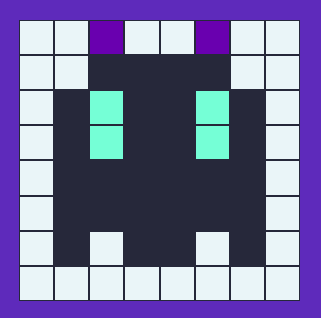

# InvaderGame
Famous game to play with Javascript. Here, you can create an avatar in pixels. Select the color and click on the box to change the color and create your own.

## Illustration

## Language
- HTML5/CSS3
- Javascript

## Step
- Work in progress

## Project
Projet realised during my programming study in O'clock. 

### Purpose
- Design a JavaScript application to reproduce a famous game
- Play with CSS
- Work with function, DOM's elements and eventListener, loop and form.
